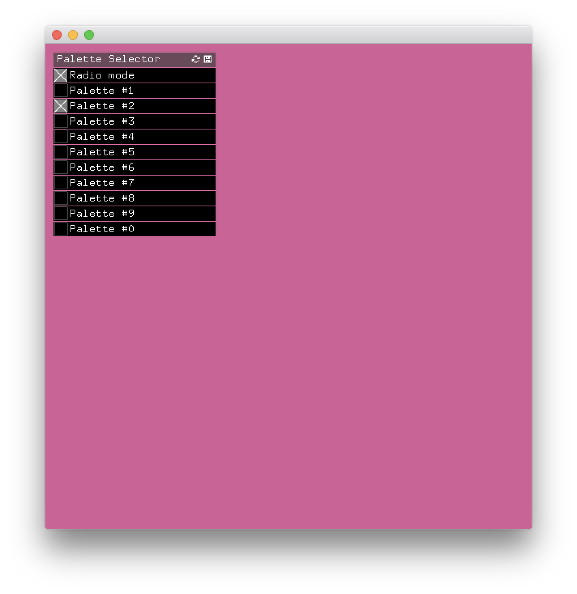

# Lamponi
🎏 – Open Frameworks keyboard controller

------------------------------------------------

# What is this?
*Lamponi* is a open framework controller for number keys, with a simple GUI and and example of how to use the triggers. 

Press `\` to switch to radio mode.

------------------------------------------------

# UI 

